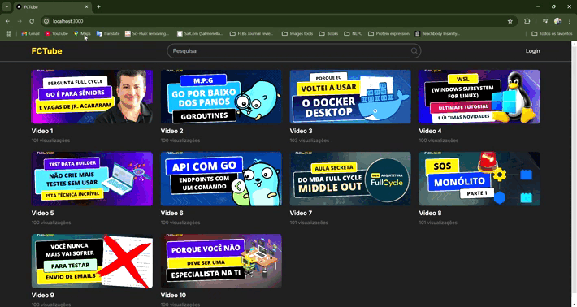
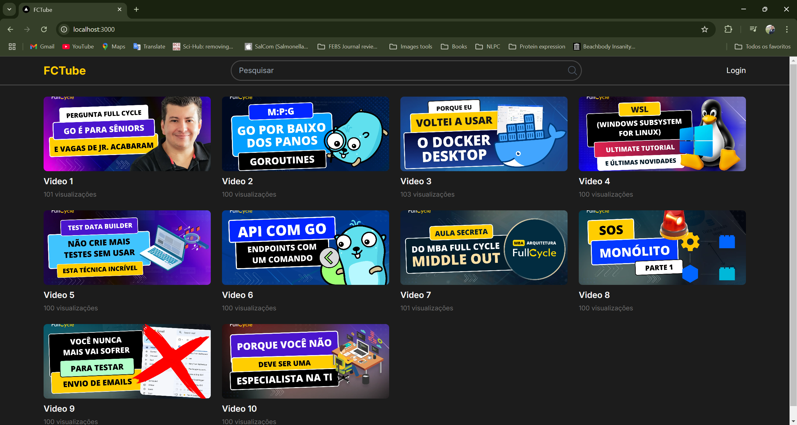
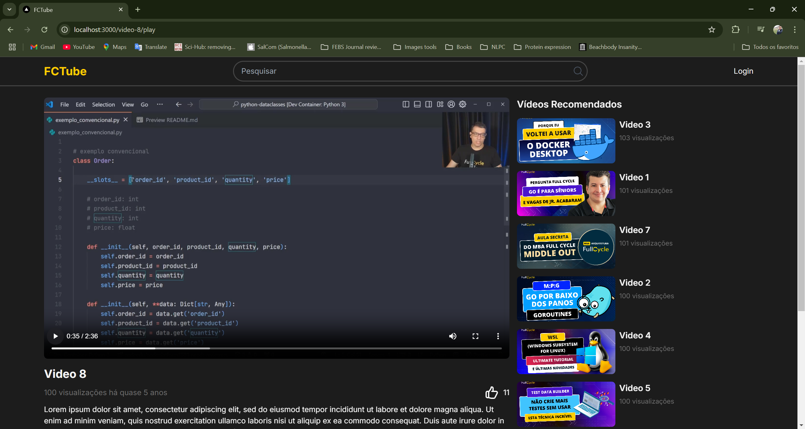
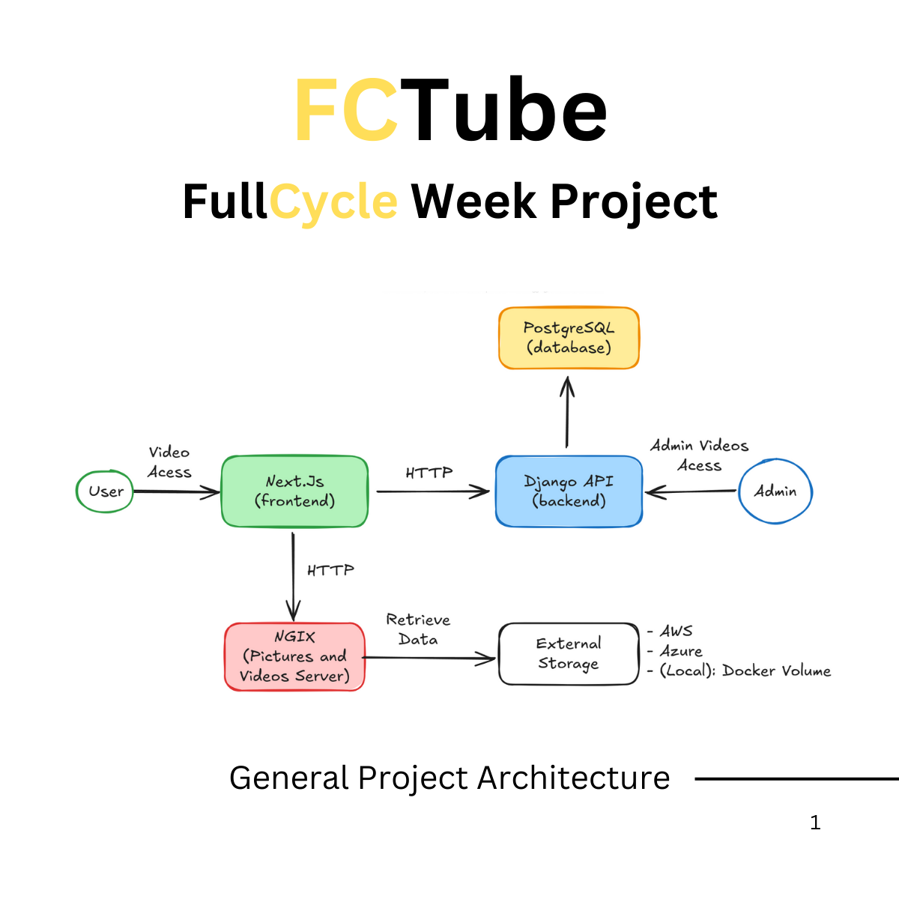
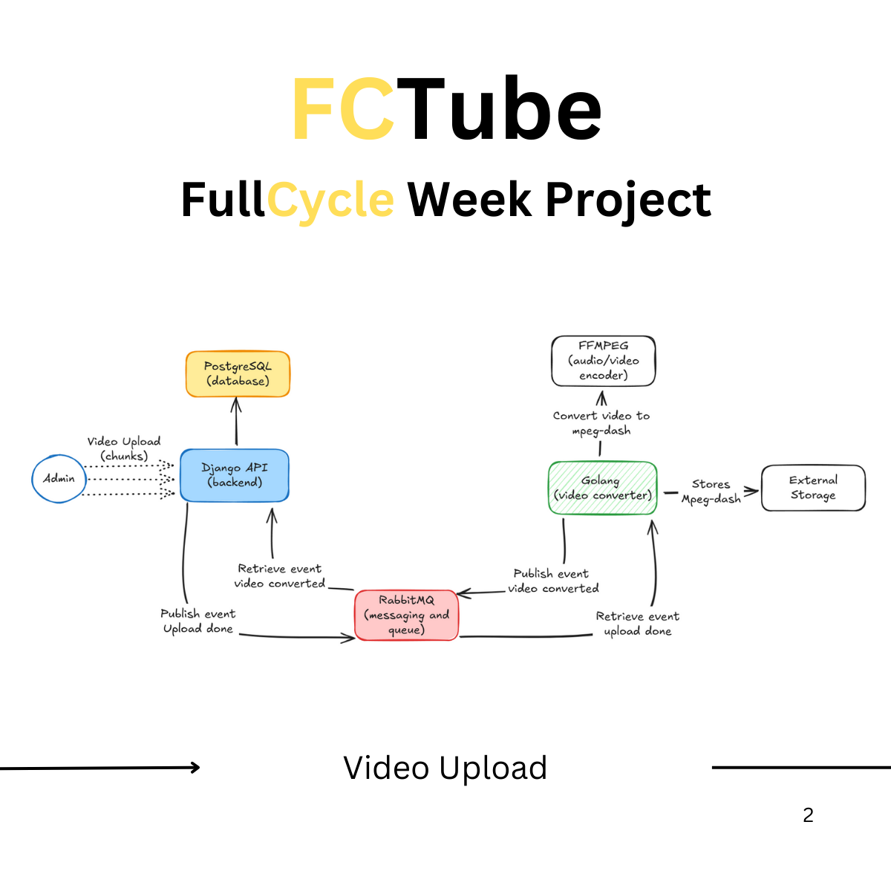
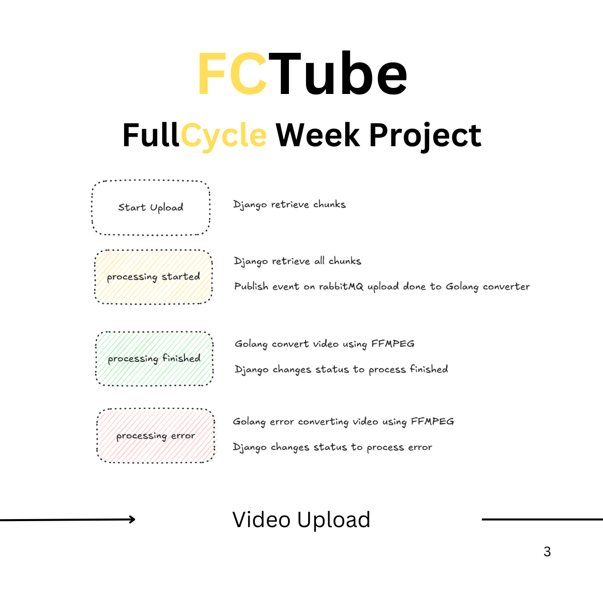
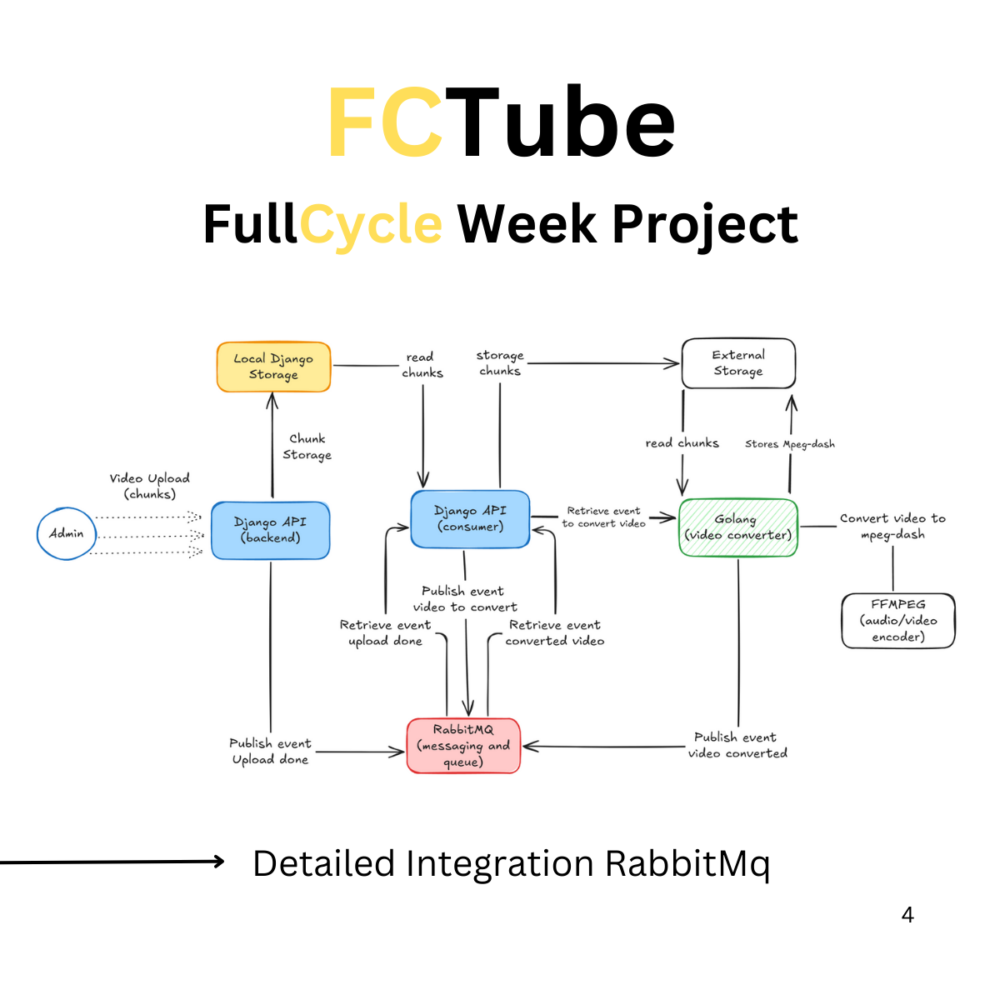

# FCTube

FCTube is a video site inspired by YouTube and Netflix, developed as part of Full Cycle Week in just one week. It allows users to browse videos, view recommendations, watch videos on the platform and interact with functions such as "like".

## Demo

<p style='text-align:center'>
  
</p>

## Main Page



## Play Page



## Arquitetura

### Arquitetura Geral do Projeto



### Video Upload Scenario



### Video Upload Status



### Detailed Integration with RabbitMQ



## General Vision

- Frontend: Developed in Next.js. It is accessed by users to interact with videos and watch published content.
- Backend: Composed of multiple services, including an API in Django, a conversion service in Golang, and asynchronous communication with RabbitMQ.
- Storage: Uses PostgreSQL for data and log persistence, and an external storage for saving videos.

## 1. Frontend (Next.js)

The Next.js frontend displays the interface to the end user, where they can:

Browse through recommended videos.
View listings of available videos on the home page.
Watch videos and interact with them (e.g. by liking them).

## 2. Backend (Django API)

This backend is split between the Django API for administration and the Golang Service for video processing.

### Django API (Admin)

This module allows administrators to:

#### Register new videos

- Upload videos and monitor the upload progress.
- View, edit, and organize published videos (e.g. title, description, tags).
- Mark videos as published after processing.
- Manage logs and reports on video likes.

- For each new video:
  - Chunking: The video is divided into smaller parts (chunks) and stored locally.
  - Upload to RabbitMQ: A message is sent to RabbitMQ to signal the video upload.
  - Upload to External Storage: Chunks are uploaded to external storage (AWS S3, Azure Blob Storage, or a local Docker volume in a development environment).

### 3. Video Conversion Service (Golang)

The Golang service handles the conversion and processing of the video. It receives notification from RabbitMQ about a new upload, and then:

- Recomposition and Processing: Reconstructs the video from the chunks in the storage.
- Conversion: Uses ffmpeg to convert the video from MP4 to MPEG-DASH, an adaptive streaming format that improves the user experience by adjusting the streaming quality based on bandwidth.
- Conversion Storage: The converted video is stored back in the external storage.
- Signaling to Django: Sends a message to RabbitMQ notifying that the conversion is complete.

### 4. Processing Notifications (RabbitMQ)

RabbitMQ is used for asynchronous communication between services:

- Notifies the Golang Service about a new upload, so it can start converting.
- Reports the completion of processing to the Django API, which changes the video status to "processing complete" and makes it available for publishing.

### 5. Storage and Logs (PostgreSQL)

All activity records and logs are stored in a PostgreSQL database, including:

- Records of messages received by RabbitMQ.
- Logs of success and failures in operations, to facilitate auditing and maintenance.
- Converting videos to MPEG-DASH (Dynamic Adaptive Streaming over HTTP) brings advantages such as:
  - Adaptive Streaming: Automatically adjusts video quality according to the user's available bandwidth.
  - User Experience: Reduces buffering time and increases content fluidity.
  - Scalability: Supports a wide variety of devices and resolutions, adapting to different network and display quality needs.

## How to Run

Run all applications with the command:

- `docker compose up -d`

With the instances mounted, access each of the services and follow the instructions:

- Golang:

  - If your postgres is already online in docker, a database called converter should have already been created.
  - Check in pgAdmin if the converter database tables are available. Through PGAdmin (pgAdmin login: admin@user.com, pgAdmin password: secret), if they are not created, create the tables from the prepare-db.sql file in the converter database (postgres password: root) if necessary.
  - You can modify the login and password values ​​in the respective docker composes.
  - Access the container by running the command: `docker compose exec go_app_dev bash`
  - Run `go run cmd/videoconverter/main.go`, which will run the mpeg dash converter app that will wait for the arrival of video chunks.
  - You should see a message like this in your terminal:
    ```bash
     Nov  3 21:32:09.297 INF Connected to PostgreSQL successfully
     Nov  3 21:32:09.340 INF Waiting for messages from RabbitMQ
    ```
  - The Go converter is now ready.

- django:

  - In a new terminal, run the command `docker compose exec django bash` to access the django application container.
  - install the dependencies: `pipenv install`
  - Access the Django virtual environment: `pipenv shell`
  - Run the migrations: `python manage.py migrate`
  - Create a superuser: `python manage.py createsuperuser`
  - Run the django server on the exposed port to be accessed by the browser: `python manage.py runserver 0.0.0.0:8000`
  - Seed with test data: `python manage.py flush && python manage.py loaddata initial_data.json`

  - configure /etc/hosts:

    - RabbitMQ is running in the Golang application's docker-compose.yaml, and Django is running in a different docker-compose.yaml, and the containers are on different networks. We will use the host.docker.internal strategy for communication between containers.
    - To do this, you need to configure an address that all Docker containers can access.
    - Add this to your /etc/hosts (for Windows, the path is C:\Windows\system32\drivers\etc\hosts): `127.0.0.1 host.docker.internal`
    - In all operating systems, you must open the program to edit hosts as the machine's Administrator or root.
    - Note: If you are using Docker Desktop, host.docker.internal may already be configured, so remove the line from the hosts file and add the one recommended above.

  - still in django conteiner, execute the consumer queues for RabbitMQ:
    - python manage.py consumer_upload_chunks_to_external_storage
    - python manage.py consumer_register_processed_video_path
    - One terminal for each. You should see a message `Waiting for messages...` in both

- Next:
  - Enter on next conteiner `docker-compose exec nextjs bash`
  - Install dependencies: `npm install`
  - Execute the frontend app: `npm run dev`
